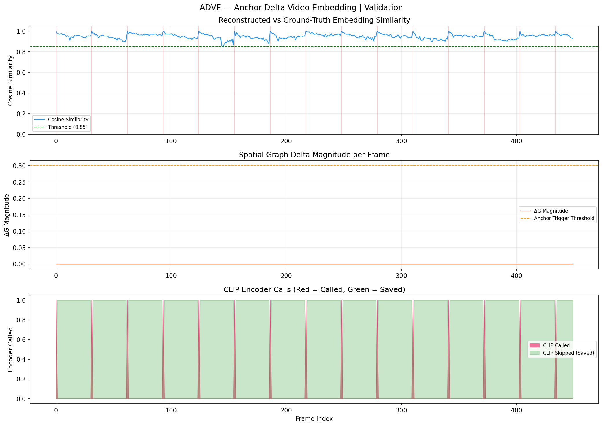

# ADVE — Anchor-Delta Video Embedding

> **96.67% fewer CLIP encoder calls. 0.9484 cosine similarity. Real-time video understanding without re-encoding every frame.**

[](https://python.org)
[](https://pytorch.org)
[](LICENSE)

---

## The Problem

Every video AI system today does this:

```
Frame 1  →  CLIP encoder  →  embedding   ← expensive
Frame 2  →  CLIP encoder  →  embedding   ← expensive
Frame 3  →  CLIP encoder  →  embedding   ← expensive
... 30 times per second, forever
```

At 30 FPS, a 1-hour video requires **108,000 encoder calls**. This is wasteful because between consecutive frames, semantic content changes by only ~2–5%.

---

## The Idea

**Embed anchor frames only. Approximate all other frames using spatial graph deltas.**

```
Frame 0  →  [CLIP + YOLO]  →  anchor embedding + SpatialGraph G₀
Frame 1  →  [YOLO only]   →  ΔG₁ → reconstruct E₁ ≈ f(E₀, ΔG₁)
Frame 2  →  [YOLO only]   →  ΔG₂ → reconstruct E₂ ≈ f(E₀, ΔG₂)
...
Frame k  →  scene change detected → new anchor
```

The **spatial graph** records pairwise object relationships (distance, angle, size ratio).
The **delta ΔG** measures how those relationships changed.
The **reconstructor** blends object embeddings weighted by area and positional stability.

Core hypothesis: `E(frame_t) ≈ f(E_anchor, ΔG(t))`

---

## Validation Results

Evaluated on a 15-second, 450-frame synthetic video (30 FPS) with 4 objects including a mid-video scene entry event (Branch 2).

| Metric | Target | Result | Status |
|--------|--------|--------|--------|
| Encoder Savings | ≥ 70% | **96.67%** | ✅ PASS |
| Mean Cosine Similarity (Δ frames) | ≥ 0.85 | **0.9484** | ✅ PASS |
| Min Cosine Similarity | — | 0.8480 | — |
| Frames Above Threshold | — | **99.77%** | — |
| CLIP Calls (450 frames) | Minimize | **15** | — |



---

## How It Works

### Anchor Frame (keyframe)
- Run **CLIP** on the full frame → `E_anchor` (512-d embedding)
- Run **YOLOv8** → detect all objects
- For each object, run **CLIP on the cropped RoI** → per-object embedding
- Build **SpatialGraph G** with pairwise relations

### Delta Frame (all others)
- Run **YOLOv8 tracking only** (no CLIP)
- Compute **ΔG** = structural change between current and anchor graph
- **Reconstruct** embedding: weighted blend of anchor object embeddings, modulated by positional stability
- No CLIP call = near-zero marginal cost per frame

### Anchor Refresh Triggers
| Trigger | Condition |
|---------|-----------|
| Spatial delta | `ΔG.total_magnitude > 0.30` |
| Appearance delta | `histogram_diff > 0.15` |
| Frame budget | `frames_since_anchor ≥ 30` |
| New object (Branch 2) | New track ID detected |

---

## Project Structure

```
adve/
├── config.py               # Thresholds, model selection, device
├── spatial_graph.py        # SpatialGraph, ObjectState, Relation, compute_delta()
├── anchor.py               # AnchorProcessor — CLIP + YOLO on keyframes
├── tracker.py              # DeltaTracker — ByteTrack only, zero CLIP
├── reconstructor.py        # EmbeddingReconstructor — core hypothesis f()
├── validator.py            # Cosine similarity metrics + matplotlib plots
├── pipeline.py             # ADVEPipeline — full orchestrator
├── main.py                 # CLI entry point
├── generate_test_video.py  # Synthetic test video generator
└── outputs/
    ├── adve_results.json   # Per-frame results + summary
    └── adve_results.png    # 3-panel validation chart
```

---

## Quickstart

```bash
# 1. Install
python -m venv adve_env && source adve_env/bin/activate
pip install torch torchvision --index-url https://download.pytorch.org/whl/cu121
pip install git+https://github.com/openai/CLIP.git
pip install ultralytics opencv-python matplotlib Pillow

# 2. Generate test video
python generate_test_video.py

# 3. Run
python main.py --video test_video.mp4

# 4. Results
cat outputs/adve_results.json
```

---

## Key Results Interpretation

The 15 CLIP encoder calls out of 450 frames break down as:
- **Frame 0**: initial anchor (mandatory)
- **Frames 30, 60, 90...**: budget trigger (every 30 frames)
- **Frame 225**: Branch 2 — new object "bottle" entered scene, triggered refresh

Every other frame was processed using only YOLOv8 tracking + pure math reconstruction.

---

## Citation

If you use ADVE in your research:

```bibtex
@misc{hariharan2025adve,
  title  = {ADVE: Anchor-Delta Video Embedding for Efficient Semantic Scene Understanding},
  author = {Hariharan, M},
  year   = {2025},
  url    = {https://github.com/Hariharan-1828/ADVE}
}
```

*DOI and arXiv links will be added upon Zenodo/preprint publication.*

---

## License

MIT License — see [LICENSE](LICENSE) for details.
